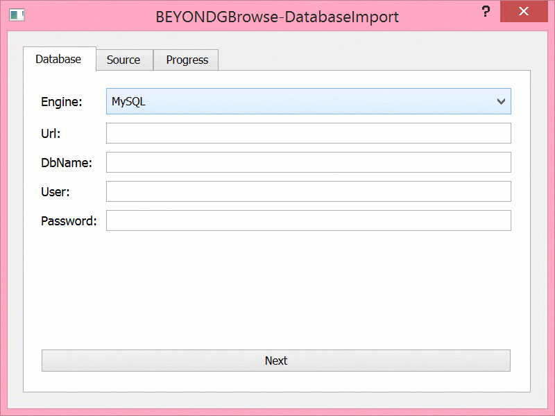
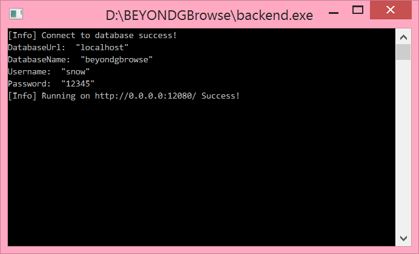
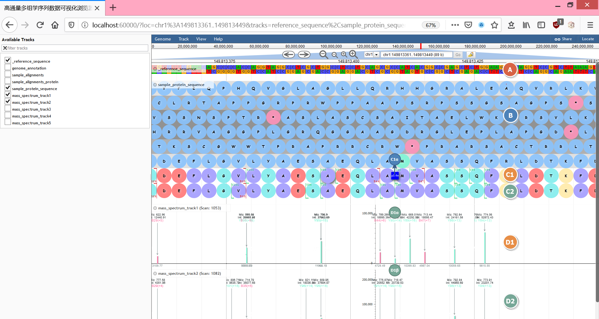

# Introduction
BEYONDGBrowse is a multi-omics sequence data visualization software based on genome browser JBrowse:

1. Visualize multi-omics data in the same browser, including genomic, transcriptomic, and proteomic data
2. Extend jBrowse with backend service, support data preprocessing
3. Support analysis of differences between multiple samples of amino acid sequences and protein mass spectra
4. Support rapid locating proteomic data
5. Support post-translational modification visualization of proteoform
6. Implemented an efficient linear fuzzy mapping algorithm for proteoform sequences and mass spectral datasets
7. Support online annotation of protein conceptual translation and proteoform sequence
8. Online annotation also provides features like multi-user, version control and searching etc.

> [Go to Chinese Version](README_zh.md)


# Catalog <!-- omit in toc -->
- [Introduction](#introduction)
- [1. JBrowse installation & configuration](#1-jbrowse-installation--configuration)
  - [Prerequisites](#prerequisites)
  - [Install dependencies](#install-dependencies)
  - [Download & compile source code](#download--compile-source-code)
  - [Data configuration demo](#data-configuration-demo)
  - [Start jBrowse](#start-jbrowse)
  - [Reference](#reference)
- [2. BEYONDGBrowse installation & configuration](#2-beyondgbrowse-installation--configuration)
  - [Frontend as a plugin](#frontend-as-a-plugin)
  - [Backend service kit](#backend-service-kit)
    - [Pre-dependence](#pre-dependence)
    - [Installation](#installation)
    - [Configuration](#configuration)
- [3. BEYONDGBrowse User Guide](#3-beyondgbrowse-user-guide)
  - [Prepare data](#prepare-data)
  - [File preprocessing](#file-preprocessing)
  - [Import data into the database](#import-data-into-the-database)
  - [Start backend services](#start-backend-services)
  - [All done](#all-done)
    - [Customization](#customization)
    - [Protein rapid locating](#protein-rapid-locating)
    - [Online annotation](#online-annotation)
    - [Annotation search](#annotation-search)
- [4. Developers](#4-developers)


# 1. JBrowse installation & configuration
## Prerequisites
- Use Linux, MacOS or Windows OS with WSL
- Sudo permissions is needed if you modify the web server file such as /var/www
- Familiarity with the command line will help you follow this tutorial

## Install dependencies
- Ubuntu/WSL/Debian OS： 

      sudo apt install git build-essential zlib1g-dev

- CentOS/RedHat：

      sudo yum groupinstall "Development Tools"
      sudo yum install git zlib-devel perl-ExtUtils-MakeMaker


## Download & compile source code
    git clone https://github.com/gmod/jbrowse jbrowse
    cd jbrowse
    git checkout 1.16.8-release # Specify v1.16.8
    ./setup.sh
For users in mainland China, it's recommended to use a npm mirror before executing the command above

    npm config set registry http://r.cnpmjs.org
    npm config set puppeteer_download_host=http://cnpmjs.org/mirrors
    export ELECTRON_MIRROR="http://cnpmjs.org/mirrors/electron/"
    

## Data configuration demo
1. Change current directory to the jbrowse root

       cd jbrowse
       mkdir data && cd data
    
2. Download reference genome FASTA file([GRCh38.p12.genome.fa](ftp://ftp.ebi.ac.uk/pub/databases/gencode/Gencode_human/release_30/GRCh38.p12.genome.fa.gz))
3. Generate FAI index：```samtools faidx GRCh38.p12.genome.fa```
4. Download sample BAM file([GRCh38.illumina.blood.1.bam](ftp://ftp.ensembl.org/pub/release-99/bamcov/homo_sapiens/genebuild/GRCh38.illumina.blood.1.bam))
5. Generate BAI index：```samtools index GRCh38.illumina.blood.1.bam```
6. Create a configuration file，```touch tracks.conf```，write and save：

       [GENERAL]
       refSeqs = GRCh38.p12.genome.fa.fai
       refSeqSelectorMaxSize = 1000

       [tracks.refseq]
       urlTemplate = GRCh38.p12.genome.fa
       storeClass = JBrowse/Store/SeqFeature/IndexedFasta
       type = JBrowse/View/Track/Sequence
       key = _reference_sequence
       label = _reference_sequence
       showTranslation = false

       [tracks.alignments]
       urlTemplate = GRCh38.illumina.blood.1.bam
       storeClass = JBrowse/Store/SeqFeature/BAM
       type = JBrowse/View/Track/Alignments2
       key = sample_alignments
       label = sample_alignments
6. The structure of jbrowse/data directory:

       jbrowse/data/
       ├── GRCh38.illumina.blood.1.bam
       ├── GRCh38.illumina.blood.1.bam.bai
       ├── GRCh38.p12.genome.fa
       ├── GRCh38.p12.genome.fa.fai
       └── tracks.conf


## Start jBrowse
- Method1：

      # Start express.js development server and listen on port 8082
      npm run start

- Method2：

      # Nginx、Apache or Other web server
      sudo chown -R `whoami` <jBrowse directory>
      sudo mv <jBrowse directory> <Web server dir, eg: /var/www>


## Reference
> http://jbrowse.org/docs/installation.html  
> http://jbrowse.org/docs/tutorial.html


# 2. BEYONDGBrowse installation & configuration
## Frontend as a plugin
- Download

      # Change current directory to Jbrowse root
      cd jbrowse/plugins
      git clone https://github.com/penguin806/BEYONDGBrowsePlugin.git BEYONDGBrowsePlugin
- Activation

      # Edit jbrowse.conf in JBrowse root, append the following:
      [ plugins.BEYONDGBrowse ]
      location = plugins/BEYONDGBrowse

- Configuration
  - Global config file: ```jbrowse_conf.json```

        # Edit jbrowse_conf.json in JBrowse root:
        {
            "BEYONDGBrowseBackendAddr" : "localhost", //IP address of the backend service
            "BEYONDGBrowseUsername" : "Snow",   // Username used for annotation
            "massSpectraTrackNum" : 5     // Number of default mass spectral tracks
        }
  - Track config file: ```tracks.conf```

        # Edit data/tracks.conf，append the following configuration：
        # Parameter urlTemplate = Corresponding data file: GRCh38.p12.genome.fa、GRCh38.illumina.blood.1.bam

        [tracks.BEYONDGBrowseProteinTrack]
        urlTemplate = GRCh38.p12.genome.fa
        storeClass = JBrowse/Store/SeqFeature/IndexedFasta
        type = BEYONDGBrowse/View/Track/SnowSequenceTrack
        key = sample_protein_sequence
        label = sample_protein_sequence
        BEYONDGBrowseProteinTrack = true
        drawCircle = true
        animationEnabled = true
        showTranslation1st = true
        showTranslation2nd = true
        showTranslation3rd = true
        showTranslationReverse1st = true
        showTranslationReverse2nd = true
        showTranslationReverse3rd = true

        [tracks.alignments_protein]
        storeClass = JBrowse/Store/SeqFeature/BAM
        urlTemplate = GRCh38.illumina.blood.1.bam
        type = JBrowse/View/Track/Alignments2
        glyph = BEYONDGBrowse/View/FeatureGlyph/AlignmentProteinGlyph
        key = sample_alignments_protein
        label = sample_alignments_protein

- Recompile and start

      # Change current directory to Jbrowse root
      npm run build
      npm run start


## Backend service kit
### Pre-dependence
- MySQL >= v5.7
  - Ubuntu: 

        sudo apt install -y mysql-server mysql-client
        sudo systemctl start mysql-server
  - CentOS 7: 

        wget https://dev.mysql.com/get/mysql80-community-release-el7-3.noarch.rpm
        sudo rpm -ivh mysql80-community-release-el7-3.noarch.rpm
        sudo yum install -y mysql-server mysql-client
        sudo systemctl start mysqld
  - CentOS 8: 

        wget https://dev.mysql.com/get/mysql80-community-release-el8-1.noarch.rpm
        sudo rpm -ivh mysql80-community-release-el8-1.noarch.rpm
        sudo yum install -y mysql-server mysql-client
        sudo systemctl start mysqld
        
  - Windows: [Download Community Version](https://dev.mysql.com/downloads/mysql/)
### Installation
- Download the precompiled binary

    > Visit [Github Release Page](https://github.com/penguin806/BEYONDGBrowseBackend/releases)，Download the software package corresponding to your system architecture, then decompress it

- Compile source code

      # OS: Ubuntu / WSL on Windows

      sudo apt update
      sudo apt install -y build-essential git
      sudo apt install -y qt5-default qtbase5-private-dev

      # Since QtHttpServer is a Beta feature in Qt-Lab until now, manually compile and install the module is needed
      git clone --recursive https://github.com/qt-labs/qthttpserver.git qthttpserver
      cd qthttpserver
      qmake && make && make install
      cd ..

      mkdir build
      git clone https://github.com/penguin806/BEYONDGBrowsePreprocessor.git BEYONDGBrowsePreprocessor
      cd BEYONDGBrowsePreprocessor
      qmake && make && cp GtfFilePreprocessor ../build
      cd ..

      git clone https://github.com/penguin806/BEYONDGBrowseDatabaseImport.git BEYONDGBrowseDatabaseImport
      cd BEYONDGBrowseDatabaseImport
      qmake && make && cp BEYONDGBrowseDatabaseTool ../build
      cd ..

      git clone https://github.com/penguin806/BEYONDGBrowseBackend.git BEYONDGBrowseBackend
      cd BEYONDGBrowseBackend
      qmake && make && cp SnowPluginBackend config.ini ../build
      cd ..build

      # If all build is successful, the file structure looks like the following
      # build/
      # ├── BEYONDGBrowseDatabaseImport
      # ├── config.ini
      # ├── GtfFilePreprocessor
      # └── SnowPluginBackend
    

### Configuration
- Edit config.ini

      [General]
      ; Backend listening port
      listenPort=12080

      [Database]
      ; MySQL Database URL
      serverAddrress=localhost
      ; MySQL Database Schema
      databaseName=beyondgbrowse
      ; MySQL Database Username
      username=snow_db201905
      ; MySQL Database Password
      password=snow_db201905


# 3. BEYONDGBrowse User Guide
## Prepare data
    sample_files/
    ├── 2DLC_H3_1_ms2.msalign
    ├── 2DLC_H3_1_ms2_topmg_proteoform.csv
    └── gencode.v29.annotation.gtf

## File preprocessing
- Gtf (Genome Annotation)  
      

- MsAlign (Mass Spectrum)  
      

- File structure after preprocessing

      sample_files/
      ├── 2DLC_H3_1_ms2.msalign
      ├── 2DLC_H3_1_ms2.msalign.output
      ├── 2DLC_H3_1_ms2_topmg_proteoform.csv
      ├── gencode.v29.annotation.gtf
      ├── gencode.v29.annotation.gtf.output
      └── gencode.v29.annotation.gtf.output.tmp

## Import data into the database
1. Enter database configuration
2. Create/select dataset
3. Start import  
      

## Start backend services


## All done
visit [http://\<jBrowse URL>/](http://localhost:60000/?loc=chr1%3A149813378..149813437&tracks=reference_sequence%2Csample_protein_sequence%2Cmass_spectrum_track1)


- A. Reference genome sequence
- B. Conceptual translation of Reference genome sequence
- C1. Proteoform sequence for sample 1
  - C1α. Proteoform modification
- C2. Proteoform sequence for sample 2
- D1. Mass spectrum of sample 1
  - D1α. Intensity
  - D1β. Mass
- D2. Mass spectrum of sample 2

> The mass spectrum is shown in RED / GREEN, which represents B-ION / Y-ION

> Meaning of different colors in amino acid：
> - GREEN (```#81ecece6```)： Hydrophilic
> - PURPLE (```#a29bfee6```)： Hydrophobic
> - RED (```#ff7675e6```)： Acidic
> - YELLOW (```#ffeaa7e6```)： Alkaline


### Customization
- Change track style  
      

- Switch dataset  
      Top Menu \<Track> -> \<Dataset select>

- Modify sample size  
      Top Menu \<Track> -> \<Set mass spectrum track number>

### Protein rapid locating
Top right Menu\<Locate>：  


### Online annotation
- Double click on amino acid 
      

- Click the drop-down menu to check and switch versions

### Annotation search
Top Menu \<Track> -> \<Search annotation>  
Support search by *Contents*, *ID*, *Author* or *IP*  


# 4. Developers
- [Jiancheng Zhong](mailto:jczhongcs@gmail.com), School of Information Science and Engineering, Hunan Normal University, Changsha, China.
- Student：
  - [Xuefeng Li](mailto:me@xuefeng.space), School of Information Science and Engineering, Hunan Normal University, Changsha, China.