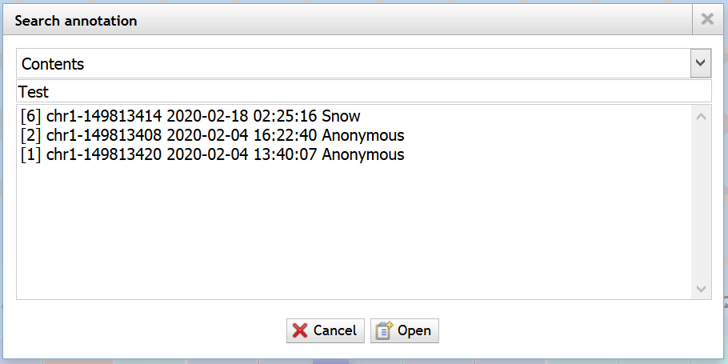

# 简介
BEYONDGBrowse是一个基于jBrowse基因组浏览器的多组学序列数据可视化软件：

1. 整合蛋白质组学数据，实现基因组、转录组、蛋白质组数据在同一浏览器中可视化
2. 提供后端服务，支持数据进行预处理
3. 支持蛋白质氨基酸序列、蛋白质质谱多样本差异分析
4. 支持蛋白质组数据全基因组快速定位
5. 支持蛋白质变体的翻译后修饰可视化
6. 实现了高效的蛋白质变体序列、质谱数据集线性模糊匹配算法
7. 蛋白质翻译、变体序列支持在线快捷注释
8. 注释支持多用户、版本管理与快速检索

> [Go to English Version](README.md)


# 索引 <!-- omit in toc -->
- [简介](#简介)
- [1. jBrowse安装与配置](#1-jbrowse安装与配置)
  - [前提条件](#前提条件)
  - [依赖安装](#依赖安装)
  - [下载&编译源码](#下载编译源码)
  - [数据配置实例](#数据配置实例)
  - [启动jBrowse](#启动jbrowse)
  - [参考文档](#参考文档)
- [2. BEYONDGBrowse安装与配置](#2-beyondgbrowse安装与配置)
  - [前端插件](#前端插件)
  - [后端服务套件](#后端服务套件)
    - [前置依赖](#前置依赖)
    - [安装](#安装)
    - [参数配置](#参数配置)
- [3. BEYONDGBrowse使用向导](#3-beyondgbrowse使用向导)
  - [数据准备](#数据准备)
  - [文件预处理](#文件预处理)
  - [导入数据库](#导入数据库)
  - [启动后端服务](#启动后端服务)
  - [开始使用](#开始使用)
    - [自定义](#自定义)
    - [快速定位](#快速定位)
    - [在线注释](#在线注释)
    - [注释检索](#注释检索)
- [4. 开发人员](#4-开发人员)


# 1. jBrowse安装与配置
## 前提条件
- 使用Linux、MacOS或装有WSL的Windows操作系统
- 如需修改Web服务器文件，例如/var/www，则需要Sudo权限
- 有一定命令行操作经验

## 依赖安装
- Ubuntu/WSL/Debian系统： 

      sudo apt install git build-essential zlib1g-dev

- CentOS/RedHat：

      sudo yum groupinstall "Development Tools"
      sudo yum install git zlib-devel perl-ExtUtils-MakeMaker


## 下载&编译源码
    git clone https://github.com/gmod/jbrowse jbrowse
    cd jbrowse
    git checkout 1.16.8-release # 指定v1.16.8版本
    ./setup.sh
对于中国大陆用户，推荐在执行上述命令之前，使用npm镜像

    npm config set registry http://r.cnpmjs.org
    npm config set puppeteer_download_host=http://cnpmjs.org/mirrors
    export ELECTRON_MIRROR="http://cnpmjs.org/mirrors/electron/"
    

## 数据配置实例
1. 切换到jbrowse根目录

       cd jbrowse
       mkdir data && cd data
    
2. 下载参考基因组序列Fasta文件([GRCh38.p12.genome.fa](ftp://ftp.ebi.ac.uk/pub/databases/gencode/Gencode_human/release_30/GRCh38.p12.genome.fa.gz))
3. 生成fai索引：```samtools faidx GRCh38.p12.genome.fa```
4. 下载样本Bam文件([GRCh38.illumina.blood.1.bam](ftp://ftp.ensembl.org/pub/release-99/bamcov/homo_sapiens/genebuild/GRCh38.illumina.blood.1.bam))
5. 生成Bai索引：```samtools index GRCh38.illumina.blood.1.bam```
6. 创建配置文件，```touch tracks.conf```，写入保存：

       [GENERAL]
       refSeqs = GRCh38.p12.genome.fa.fai
       refSeqSelectorMaxSize = 1000

       [tracks.refseq]
       urlTemplate = GRCh38.p12.genome.fa
       storeClass = JBrowse/Store/SeqFeature/IndexedFasta
       type = JBrowse/View/Track/Sequence
       key = _reference_sequence
       label = _reference_sequence
       showTranslation = false

       [tracks.alignments]
       urlTemplate = GRCh38.illumina.blood.1.bam
       storeClass = JBrowse/Store/SeqFeature/BAM
       type = JBrowse/View/Track/Alignments2
       key = sample_alignments
       label = sample_alignments
6. jbrowse/data目录结构：

       jbrowse/data/
       ├── GRCh38.illumina.blood.1.bam
       ├── GRCh38.illumina.blood.1.bam.bai
       ├── GRCh38.p12.genome.fa
       ├── GRCh38.p12.genome.fa.fai
       └── tracks.conf


## 启动jBrowse
- Method1：

      # 启动express.js开发服务器并监听8082端口
      npm run start

- Method2：

      # Nginx、Apache等其他Web服务器
      sudo chown -R `whoami` <jBrowse目录>
      sudo mv <jBrowse目录> <Web服务器根目录，例如>


## 参考文档
> http://jbrowse.org/docs/installation.html  
> http://jbrowse.org/docs/tutorial.html


# 2. BEYONDGBrowse安装与配置
## 前端插件
- 下载

      # 切换到jBrowse插件目录
      cd jbrowse/plugins
      git clone https://github.com/penguin806/BEYONDGBrowsePlugin.git BEYONDGBrowsePlugin
- 激活

      # 编辑jbrowse根目录配置文件jbrowse.conf，在末尾加入以下内容
      [ plugins.BEYONDGBrowse ]
      location = plugins/BEYONDGBrowse

- 配置
  - 全局配置文件```jbrowse_conf.json```

        # 编辑jbrowse根目录jbrowse_conf.json，在json对象中写入属性，例如：
        {
            "BEYONDGBrowseBackendAddr" : "localhost", //后端服务的IP地址
            "BEYONDGBrowseUsername" : "Snow",   // 在线注释使用的用户名
            "massSpectraTrackNum" : 5     //默认质谱轨道数目
        }
  - 轨道配置文件```tracks.conf```

        # 编辑data/tracks.conf，在末尾加入配置：
        # 参数urlTemplate = 分别对应实际数据文件GRCh38.p12.genome.fa、GRCh38.illumina.blood.1.bam

        [tracks.BEYONDGBrowseProteinTrack]
        urlTemplate = GRCh38.p12.genome.fa
        storeClass = JBrowse/Store/SeqFeature/IndexedFasta
        type = BEYONDGBrowse/View/Track/SnowSequenceTrack
        key = sample_protein_sequence
        label = sample_protein_sequence
        BEYONDGBrowseProteinTrack = true
        drawCircle = true
        animationEnabled = true
        showTranslation1st = true
        showTranslation2nd = true
        showTranslation3rd = true
        showTranslationReverse1st = true
        showTranslationReverse2nd = true
        showTranslationReverse3rd = true

        [tracks.alignments_protein]
        storeClass = JBrowse/Store/SeqFeature/BAM
        urlTemplate = GRCh38.illumina.blood.1.bam
        type = JBrowse/View/Track/Alignments2
        glyph = BEYONDGBrowse/View/FeatureGlyph/AlignmentProteinGlyph
        key = sample_alignments_protein
        label = sample_alignments_protein

- 重新编译并启动

      # 切换到jBrowse根目录
      npm run build
      npm run start


## 后端服务套件
### 前置依赖
- MySQL >= v5.7
  - Ubuntu: 

        sudo apt install -y mysql-server mysql-client
        sudo systemctl start mysql-server
  - CentOS 7: 

        wget https://dev.mysql.com/get/mysql80-community-release-el7-3.noarch.rpm
        sudo rpm -ivh mysql80-community-release-el7-3.noarch.rpm
        sudo yum install -y mysql-server mysql-client
        sudo systemctl start mysqld
  - CentOS 8: 

        wget https://dev.mysql.com/get/mysql80-community-release-el8-1.noarch.rpm
        sudo rpm -ivh mysql80-community-release-el8-1.noarch.rpm
        sudo yum install -y mysql-server mysql-client
        sudo systemctl start mysqld
        
  - Windows: [Download Community Version](https://dev.mysql.com/downloads/mysql/)
### 安装
- 下载已编译程序

    > 访问[Github Release Page](https://github.com/penguin806/BEYONDGBrowseBackend/releases)，下载对应系统架构的软件包，解压缩

- 源码编译

      # OS: Ubuntu / WSL on Windows

      sudo apt update
      sudo apt install -y build-essential git
      sudo apt install -y qt5-default qtbase5-private-dev

      # Since QtHttpServer is a Beta feature in Qt-Lab until now, manually compile and install the module is needed
      git clone --recursive https://github.com/qt-labs/qthttpserver.git qthttpserver
      cd qthttpserver
      qmake && make && make install
      cd ..

      mkdir build
      git clone https://github.com/penguin806/BEYONDGBrowsePreprocessor.git BEYONDGBrowsePreprocessor
      cd BEYONDGBrowsePreprocessor
      qmake && make && cp GtfFilePreprocessor ../build
      cd ..

      git clone https://github.com/penguin806/BEYONDGBrowseDatabaseImport.git BEYONDGBrowseDatabaseImport
      cd BEYONDGBrowseDatabaseImport
      qmake && make && cp BEYONDGBrowseDatabaseTool ../build
      cd ..

      git clone https://github.com/penguin806/BEYONDGBrowseBackend.git BEYONDGBrowseBackend
      cd BEYONDGBrowseBackend
      qmake && make && cp SnowPluginBackend config.ini ../build
      cd ..build

      # If all build is successful, the file structure looks like the following
      # build/
      # ├── BEYONDGBrowseDatabaseImport
      # ├── config.ini
      # ├── GtfFilePreprocessor
      # └── SnowPluginBackend
    

### 参数配置
- 编辑config.ini

      [General]
      ; 后端监听端口
      listenPort=12080

      [Database]
      ; MySQL数据库主机地址
      serverAddrress=localhost
      ; MySQL数据库名
      databaseName=beyondgbrowse
      ; MySQL用户名
      username=snow_db201905
      ; MySQL用户密码
      password=snow_db201905


# 3. BEYONDGBrowse使用向导
## 数据准备
    sample_files/
    ├── 2DLC_H3_1_ms2.msalign
    ├── 2DLC_H3_1_ms2_topmg_proteoform.csv
    └── gencode.v29.annotation.gtf

## 文件预处理
- Gtf (Genome Annotation)  
      

- MsAlign (Mass Spectrum)  
      

- 预处理结束后文件结构

      sample_files/
      ├── 2DLC_H3_1_ms2.msalign
      ├── 2DLC_H3_1_ms2.msalign.output
      ├── 2DLC_H3_1_ms2_topmg_proteoform.csv
      ├── gencode.v29.annotation.gtf
      ├── gencode.v29.annotation.gtf.output
      └── gencode.v29.annotation.gtf.output.tmp

## 导入数据库
1. 输入数据库参数
2. 创建/选择数据集
3. 开始导入  
      

## 启动后端服务


## 开始使用
浏览器访问[http://\<jBrowse URL>/](http://localhost:60000/?loc=chr1%3A149813378..149813437&tracks=reference_sequence%2Csample_protein_sequence%2Cmass_spectrum_track1)


- A. 参考基因序列
- B. 参考蛋白质翻译
- C1. 样本1蛋白质变体序列
  - C1α. 蛋白质变体修饰
- C2. 样本2蛋白质变体序列
- D1. 样本1质谱
  - D1α. 峰度
  - D1β. 质量
- D2. 样本2质谱

> 质谱红色/绿色，分别代表B离子/Y离子

> 蛋白质变体颜色含义：
> - 绿色 (```#81ecece6```)： 亲水性
> - 紫色 (```#a29bfee6```)： 疏水性
> - 红色 (```#ff7675e6```)： 酸性
> - 黄色 (```#ffeaa7e6```)： 碱性


### 自定义
- 改变轨道样式  
      

- 切换数据集
      顶部菜单\<Track> -> \<Dataset select>

- 修改样本数量
      顶部菜单\<Track> -> \<Set mass spectrum track number>

### 快速定位
右上角菜单\<Locate>：  


### 在线注释
- 鼠标左键双击蛋白质参考翻译/蛋白质变体，发起注释  
      

- 点击对话框下拉菜单切换历史版本

### 注释检索
顶部菜单\<Track> -> \<Search annotation>  
支持以 *内容*、*ID*、*作者* 或 *IP地址* 作为条件查找  


# 4. 开发人员
- 钟坚成教授 湖南师范大学 邮箱：[jczhongcs@gmail.com](mailto:jczhongcs@gmail.com)
- 学生：
  - 李学锋 湖南师范大学 邮箱：[me@xuefeng.space](mailto:me@xuefeng.space)